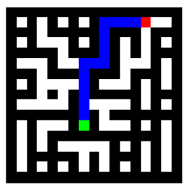
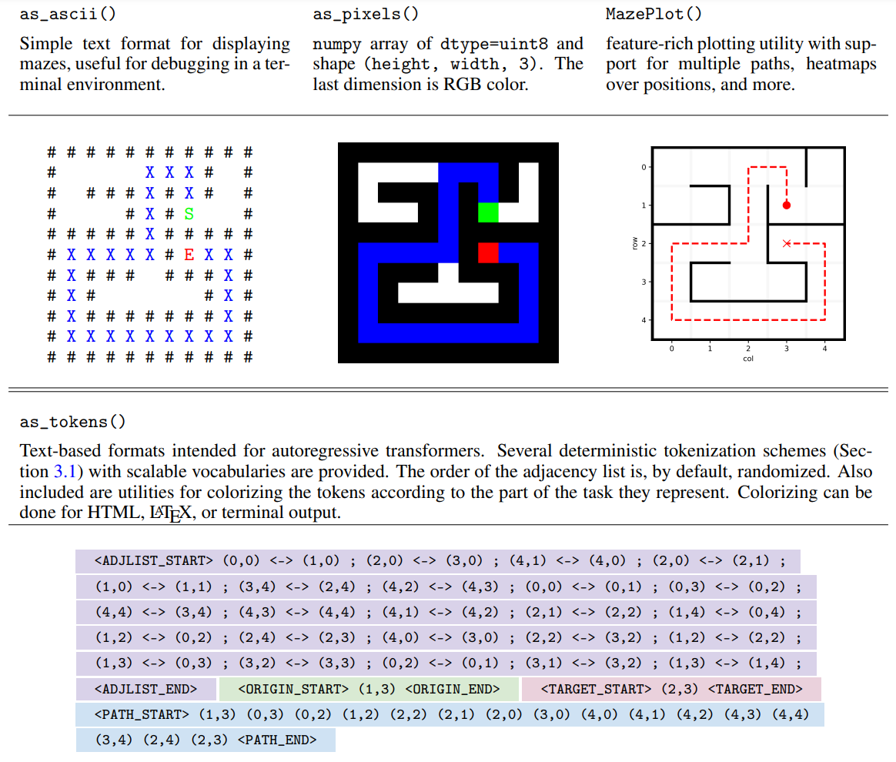

[](https://pypi.org/project/maze-dataset/)

[](https://github.com/understanding-search/maze-dataset/actions/workflows/checks.yml)
[](docs/coverage/coverage.txt)


# `maze-dataset`

This package provides utilities for generation, filtering, solving, visualizing, and processing of mazes for training ML systems. Primarily built for the [maze-transformer interpretability](https://github.com/understanding-search/maze-transformer) project. You can find our paper on it here: http://arxiv.org/abs/2309.10498

This package includes a variety of [maze generation algorithms](maze_dataset/generation/generators.py), including randomized depth first search, Wilson's algorithm for uniform spanning trees, and percolation. Datasets can be filtered to select mazes of a certain length or complexity, remove duplicates, and satisfy custom properties. A variety of output formats for visualization and training ML models are provided.

|   |   |   |   |
|---|---|---|---|
|  |    |    |    |


# Usage

Most of the functionality is demonstrated in the ipython notebooks in the `notebooks/` folder.

- [`demo_dataset.ipynb`](notebooks/demo_dataset.ipynb) how to easily create a dataset of mazes, utilities for filtering the generates mazes via properties, and basic visualization. View this one first.
- [`demo_tokenization.ipynb`](notebooks/demo_tokenization.ipynb) converting mazes to and from textual representations, as well as utilities for working with them.
- [`demo_latticemaze.ipynb`](notebooks/demo_latticemaze.ipynb) internals of the `LatticeMaze` and `SolvedMaze` objects, and advanced visualization.

## Creating a dataset

To create a `MazeDataset`, which inherits from `torch.utils.data.Dataset`, you first create a `MazeDatasetConfig`:

```python
from maze_dataset import MazeDataset, MazeDatasetConfig
from maze_dataset.generation import LatticeMazeGenerators
cfg: MazeDatasetConfig = MazeDatasetConfig(
	name="test", # name is only for you to keep track of things
	grid_n=5, # number of rows/columns in the lattice
	n_mazes=4, # number of mazes to generate
	maze_ctor=LatticeMazeGenerators.gen_dfs, # algorithm to generate the maze
    maze_ctor_kwargs=dict(do_forks=False), # additional parameters to pass to the maze generation algorithm
)
```

and then pass this config to the `MazeDataset.from_config` factory method:

```python
dataset: MazeDataset = MazeDataset.from_config(
    # your config
	cfg,
    # and all this below is completely optional
	# do_download=False,
	# load_local=False,
	# do_generate=True,
    # save_local=True,
	# gen_parallel=False,
)
```

This method can search for whether a dataset with matching config hash already exists on your filesystem in the expected location, and load it if so. It can also generate a dataset on the fly if needed.

## Conversions to useful formats

The elements of the dataset are [`SolvedMaze`](maze_dataset/maze/lattice_maze.py) objects:
```python
>>> m = dataset[0]
>>> type(m)
maze_dataset.maze.lattice_maze.SolvedMaze
```

Which can be converted to a variety of formats:
```python
# visual representation as ascii art
m.as_ascii() 
# RGB image, optionally without solution or endpoints, suitable for CNNs
m.as_pixels() 
# text format for autoreregressive transformers
from maze_dataset.tokenization import MazeTokenizer, TokenizationMode
m.as_tokens(maze_tokenizer=MazeTokenizer(
    tokenization_mode=TokenizationMode.AOTP_UT_rasterized, max_grid_size=100,
))
# advanced visualization with many features
from maze_dataset.plotting import MazePlot
MazePlot(maze).plot()
```




# Installation
This package is [available on PyPI](https://pypi.org/project/maze-dataset/), and can be installed via
```
pip install maze-dataset
```


# Development

This project uses [Poetry](https://python-poetry.org/docs/#installation) for development. To install with dev requirements, run
```
poetry install --with dev
```

A makefile is included to simplify common development tasks:

- `make help` will print all available commands
- all tests via `make test`
    - unit tests via `make unit`
    - notebook tests via `make test_notebooks`
- formatter (black, pycln, and isort) via `make format`
    - formatter in check-only mode via `make check-format`


# Citing

If you use this code in your research, please cite [our paper](http://arxiv.org/abs/2309.10498):

```
@misc{maze-dataset,
    title={A Configurable Library for Generating and Manipulating Maze Datasets}, 
    author={Michael Igorevich Ivanitskiy and Rusheb Shah and Alex F. Spies and Tilman Räuker and Dan Valentine and Can Rager and Lucia Quirke and Chris Mathwin and Guillaume Corlouer and Cecilia Diniz Behn and Samy Wu Fung},
    year={2023},
    eprint={2309.10498},
    archivePrefix={arXiv},
    primaryClass={cs.LG},
    url={http://arxiv.org/abs/2309.10498}
}
```