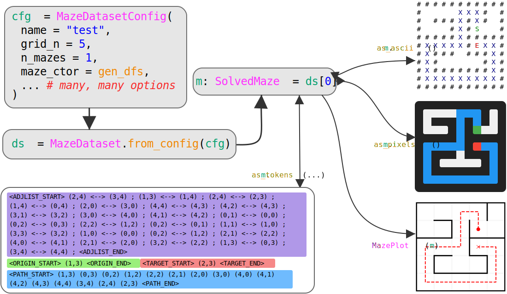

# Summary

Solving mazes is a classic problem in computer science and artificial intelligence, and humans have been constructing mazes for thousands of years. Although finding the shortest path through a maze is a solved problem, this very fact makes it an excellent testbed for studying how machine learning algorithms solve problems and represent spatial information. We introduce `maze-dataset`, a user-friendly Python library for generating, processing, and visualizing datasets of mazes. This library supports a variety of maze generation algorithms providing mazes with or without loops, mazes that are connected or not, and many other variations. These generation algorithms can be configured with various parameters, and the resulting mazes can be filtered to satisfy desired properties. Also provided are tools for converting mazes to and from various formats suitable for a variety of neural network architectures, such as rasterized images, tokenized text sequences, and various visualizations. As well as providing a simple interface for generating, storing, and loading these datasets, `maze-dataset` is extensively tested, type hinted, benchmarked, and documented.

\begin{figure} 
  \begin{minipage}{5in}
    \input{diagram/diagram.tikz} 
  \end{minipage}
  \caption{
    Usage of maze-dataset. We create a \texttt{MazeDataset} from a \texttt{MazeDatasetConfig}. This contains \texttt{SolvedMaze} objects which can be converted to and from a variety of formats. Code in the image contains clickable links to \docslink{maze_dataset.html}{documentation}. A variety of generated examples can be viewed \docslink{examples/maze_examples.html}{here}.
  }
  \label{fig:diagram}
\end{figure}

<!-- [examples](https://understanding-search.github.io/maze-dataset/examples/maze_examples.html)
[docs]()

 -->

```{=html}

```

# Statement of Need

While maze generation itself is straightforward, the architectural challenge comes from building a system supporting many algorithms with configurable parameters, property filtering, and representation transformation. This library aims to greatly streamline the process of generating and working with datasets of mazes that can be described as subgraphs of an $n \times n$ lattice with boolean connections and, optionally, start and end points that are nodes in the graph. Furthermore, we place emphasis on a wide variety of possible text output formats aimed at evaluating the spatial reasoning capabilities of Large Language Models and other text-based transformer models.

For interpretability and behavioral research, algorithmic tasks offer benefits by allowing systematic data generation and task decomposition, as well as simplifying the process of circuit discovery [@interpretability-survery]. Although mazes are well suited for these investigations, we found that existing maze generation packages [@cobbe2019procgen; @harriesMazeExplorerCustomisable3D2019; @gh_Ehsan_2022; @gh_Nemeth_2019; @easy_to_hard] lack support for transforming between multiple representations and provide limited control over the maze generation process.


## Related Works

A multitude of public and open-source software packages exist for generating mazes [@easy_to_hard; @gh_Ehsan_2022; @gh_Nemeth_2019]. However, nearly all of these packages produce mazes represented as rasterized images or other visual formats rather than the underlying graph structure, and this makes it difficult to work with these datasets.

- Most prior works provide mazes in visual or raster formats, and we provide a variety of similar output formats:
  - [`RasterizedMazeDataset`](https://understanding-search.github.io/maze-dataset/maze_dataset/dataset/rasterized.html#RasterizedMazeDataset), utilizing [`as_pixels()`](https://understanding-search.github.io/maze-dataset/maze_dataset.html#LatticeMaze.as_pixels), which can exactly mimic the outputs provided in `easy-to-hard-data`[@easy_to_hard] and can be configured to be similar to the outputs of @gh_Nemeth_2019
  - [`as_ascii()`](https://understanding-search.github.io/maze-dataset/maze_dataset.html#LatticeMaze.as_ascii) provides a format similar to that used in [@eval-gpt-visual; @gh-oppenheimj2018maze]
  - [`MazePlot`](https://understanding-search.github.io/maze-dataset/maze_dataset/plotting.html#MazePlot) provides a feature-rich plotting utility with support for multiple paths, heatmaps over positions, and more. This is similar to the outputs of [@mdl-suite; @mathematica-maze; @mazegenerator-net; @gh_Ehsan_2022]


- The text format provided by [`SolvedMaze(...).as_tokens()`](https://understanding-search.github.io/maze-dataset/maze_dataset.html#MazeDataset.as_tokens) is similar to that of [@eval-LLM-graphs], but provides over 5.8 million unique formats for converting mazes to a text stream, detailed in \autoref{tokenized-output-formats}.

- For rigorous investigations of the response of a model to various distributional shifts, preserving metadata about the generation algorithm with the dataset itself is essential. To this end, our package efficiently stores the dataset along with its metadata in a single human-readable file [@zanj]. As far as we are aware, no existing packages do this reliably.

- Storing mazes as images is not only difficult to work with, but also inefficient. We use a highly efficient method detailed in \autoref{implementation}.

- Our package is easily installable with source code freely available. It is extensively tested, type hinted, benchmarked, and documented. Many other maze generation packages lack this level of rigor and scope, and some [@ayaz2008maze] appear to simply no longer be accessible.


# Features

## Generation and Basic Usage {#generation}

Our package can be installed from [PyPi](https://pypi.org/project/maze-dataset/) via `pip install maze-dataset`, or directly from the [git repository](https://github.com/understanding-search/maze-dataset) [@maze-dataset-github].

To create a dataset, we first create a [`MazeDatasetConfig`](https://understanding-search.github.io/maze-dataset/maze_dataset.html#MazeDatasetConfig) configuration object, which specifies the seed, number, and size of mazes, as well as the generation algorithm and its corresponding parameters. This object is passed to a [`MazeDataset`](https://understanding-search.github.io/maze-dataset/maze_dataset.html#MazeDataset) class to create a dataset. Crucially, this [`MazeDataset`](https://understanding-search.github.io/maze-dataset/maze_dataset.html#MazeDataset) mimics the interface of a PyTorch [@pytorch] [`Dataset`](https://pytorch.org/docs/stable/data.html), and can thus be easily incorporated into existing data pre-processing and training pipelines, e.g., through the use of a `DataLoader` class.

```python
from maze_dataset import (
  MazeDataset, MazeDatasetConfig, LatticeMazeGenerators
)
# create a config
cfg: MazeDatasetConfig = MazeDatasetConfig(
    name="example", # names need not be unique
    grid_n=3,   # size of the maze
    n_mazes=32, # number of mazes in the dataset
    maze_ctor=LatticeMazeGenerators.gen_dfs, # many algorithms available
    # (optional) algorithm-specific parameters
    maze_ctor_kwargs={"do_forks": True, ...}, 
    # (optional) many options for restricting start/end points
    endpoint_kwargs={"deadend_start": True, ...},
)
# create a dataset
dataset: MazeDataset = MazeDataset.from_config(
  cfg, # pass the config
  ..., # other options such as whether to load from disk,
       # generate in parallel, etc.
)
```

When initializing a dataset, options which do not affect the mazes themselves can be specified through the [`from_config()`](https://understanding-search.github.io/maze-dataset/maze_dataset.html#MazeDataset.from_config) factory method as necessary. These options allow for saving/loading existing datasets instead of re-generating, parallelization options for generation, and more. Available maze generation algorithms are static methods of the [`LatticeMazeGenerators`](https://understanding-search.github.io/maze-dataset/maze_dataset.html#LatticeMazeGenerators) namespace class and include generation algorithms based on randomized depth-first search, Wilson's algorithm [@wilson], percolation [@percolation; @percolation-clustersize], Kruskal's algorithm [@kruskal1956shortest], and others.

Furthermore, a dataset of mazes can be filtered to satisfy certain properties. Custom filters can be specified, and some filters are included in [`MazeDatasetFilters`](https://understanding-search.github.io/maze-dataset/maze_dataset/dataset/filters.html#MazeDatasetFilters). For example, we can require a minimum path length of three steps from the origin to the target:

```python
dataset_filtered: MazeDataset = dataset.filter_by.path_length(min_length=3)
```

All implemented maze generation algorithms are stochastic by nature. For reproducibility, the `seed` parameter of [`MazeDatasetConfig`](https://understanding-search.github.io/maze-dataset/maze_dataset.html#MazeDatasetConfig) may be set. In practice, using provided deduplication filters, we do find that exact duplicate mazes are generated very infrequently, even when generating very large datasets.

For use cases where mazes of different sizes, generation algorithms, or other parameter variations are required, we provide the [`MazeDatasetCollection`](https://understanding-search.github.io/maze-dataset/maze_dataset/dataset/collected_dataset.html#MazeDatasetCollection) class, which allows for creating a single iterable dataset from multiple independent configurations.

## Visual Output Formats {#visual-output-formats}

Internally, mazes are [`SolvedMaze`](https://understanding-search.github.io/maze-dataset/maze_dataset.html#SolvedMaze) objects, which have path information and a tensor optimized for storing sub-graphs of a lattice. These objects can be converted to and from several formats to maximize their utility in different contexts.

\begin{figure}[H]
  \centering
  \begin{tabular}{p{1.5in} p{1.5in} p{1.5in}} 
    \hline \\[.5em]
    % algorithms
    \docslink{maze_dataset.html\#LatticeMaze.as_ascii}{\texttt{as\_ascii()}}
    & \docslink{maze_dataset.html\#LatticeMaze.as_pixels}{\texttt{as\_pixels()}}
    & \docslink{maze_dataset/plotting.html\#MazePlot}{\texttt{MazePlot()}} \\[.5em]
    % descriptions
      Simple text format for displaying mazes, useful for debugging in a terminal environment.
      & \texttt{numpy} array of \texttt{dtype=uint8} and shape \texttt{(height, width, 3)}. The last dimension is RGB color.
      & feature-rich plotting utility with support for multiple paths, heatmaps over positions, and more. \\[1em]
    \hline \\
    % examples
      \multicolumn{1}{c}{\begin{minipage}[b]{1.6in}
        \setlength{\baselineskip}{0.9em}
        \input{figures/outputs-ascii-colored.tex} 
      \end{minipage}}
      & \multicolumn{1}{c}{
        \includegraphics[width=0.25\textwidth]{figures/outputs-pixels.pdf}
      }
      & \multicolumn{1}{c}{
        \includegraphics[width=0.27\textwidth, trim={0 0.8cm -.3cm, -.5cm}, clip]{figures/outputs-mazeplot.pdf}
      } \\[1em]
    
    \hline \\
  \end{tabular}
  \caption{Various output formats. Top row (left to right): ASCII diagram, rasterized pixel grid, and advanced display tool.}
  \label{fig:output-fmts}
\end{figure}

In previous work, maze tasks have been used with Recurrent Convolutional Neural Network (RCNN) derived architectures [@deepthinking]. To facilitate the use of our package in this context, we replicate the format of [@easy_to_hard] and provide the [`RasterizedMazeDataset`](https://understanding-search.github.io/maze-dataset/maze_dataset/dataset/rasterized.html#RasterizedMazeDataset) class which returns rasterized pairs of (input, target) mazes as shown in \autoref{fig:e2h-raster} below.

{#fig:e2h-raster width=30%}


## Tokenized Output Formats {#tokenized-output-formats}

Autoregressive transformer models can be quite sensitive to the exact format of input data, and may even use delimiter tokens to perform reasoning steps [@pfau2024dotbydot; @spies2024causalworldmodels]. To facilitate systematic investigation of the effects of different representations of data on text model performance, we provide a variety of tokenized text output formats.

We convert mazes to token sequences in two steps. First, the maze is stringified using [`as_tokens()`](https://understanding-search.github.io/maze-dataset/maze_dataset.html#MazeDataset.as_tokens). The [`MazeTokenizerModular`](https://understanding-search.github.io/maze-dataset/maze_dataset/tokenization.html#MazeTokenizerModular) class provides a powerful interface for configuring maze stringification behavior. Second, the sequence of strings is tokenized into integers using `encode()`. Tokenization uses a fixed vocabulary for simplicity. Mazes up to $50 \times 50$ are supported when using a unique token for each position, and up to $128 \times 128$ are supported when positions in the maze are represented as a pair of coordinates.

There are many algorithms by which one might tokenize a 2D maze into a 1D format usable by autoregressive text models. Training multiple models on the encodings output from each of these algorithms may produce very different internal representations, learned solution algorithms, and levels of performance. To allow exploration of how different maze tokenization algorithms affect these models, the [`MazeTokenizerModular`](https://understanding-search.github.io/maze-dataset/maze_dataset/tokenization.html#MazeTokenizerModular) class contains a rich set of options to customize how mazes are stringified. This class contains 19 discrete parameters, resulting in over 5.8 million unique tokenizers. There are 6 additional parameters available whose functionality is not verified via automated testing, but further expand the the number of tokenizers by a factor of $44/3$ to 86 million.

All output sequences consist of four token regions representing different features of the maze; an example output sequence is shown in \autoref{fig:token-regions}.

\begin{figure} 
  \centering
  \begin{minipage}{5in}
    \footnotesize
    \input{figures/outputs-tokens-colored.tex}
  \end{minipage}
  \caption{
    Example text output format with token regions highlighted.
    \colorbox[RGB]{ 217,210,233 }{Adjacency list}: text representation of the graph,
    \colorbox[RGB]{ 217,234,211 }{Origin}: starting coordinate,
    \colorbox[RGB]{ 234,209,220 }{Target}: ending coordinate,
    \colorbox[RGB]{ 207,226,243 }{Path}: maze solution sequence
  }
  \label{fig:token-regions}
\end{figure}

Each [`MazeTokenizerModular`](https://understanding-search.github.io/maze-dataset/maze_dataset/tokenization.html#MazeTokenizerModular) is constructed from a set of several [`_TokenizerElement`](https://understanding-search.github.io/maze-dataset/maze_dataset/tokenization.html#_TokenizerElement) objects, each of which specifies how different token regions or other elements of the stringification are produced.

\begin{figure}
    \centering
    \input{figures/TokenizerElement_structure.tikz}
    \caption{Nested internal structure of \texttt{\_TokenizerElement} objects inside a typical \texttt{MazeTokenizerModular}.}
\end{figure}

The tokenizer architecture is purposefully designed such that adding and testing a wide variety of new tokenization algorithms is fast and minimizes disturbances to functioning code. This is enabled by the modular architecture and the automatic inclusion of any new tokenizers in integration tests. To create a new variety of tokenizer, developers forking the library may simply create their own [`_TokenizerElement`](https://understanding-search.github.io/maze-dataset/maze_dataset/tokenization.html#_TokenizerElement) subclass and implement the abstract methods. If the behavior change is sufficiently small, simply adding a parameter to an existing [`_TokenizerElement`](https://understanding-search.github.io/maze-dataset/maze_dataset/tokenization.html#_TokenizerElement) subclass and updating its implementation will suffice.

The breadth of tokenizers is also easily scaled in the opposite direction. Due to the exponential scaling of parameter combinations, adding a small number of new features can significantly slow certain procedures which rely on constructing all possible tokenizers, such as integration tests. If any existing subclass contains features which aren't needed, a developer tool decorator [`@mark_as_unsupported`](https://understanding-search.github.io/maze-dataset/maze_dataset/tokenization/modular/element_base.html#mark_as_unsupported) is provided which can be applied to the unneeded [`_TokenizerElement`](https://understanding-search.github.io/maze-dataset/maze_dataset/tokenization.html#_TokenizerElement) subclasses to prune those features and compact the available space of tokenizers.

## Benchmarks of Generation Speed {#benchmarks}

We provide approximate benchmarks for relative generation time across various algorithms, parameter choices, maze sizes, and dataset sizes in \autoref{tab:benchmarks} and \autoref{fig:benchmarks}. Experiments were performed on a \href{https://docs.github.com/en/actions/using-github-hosted-runners/using-github-hosted-runners/about-github-hosted-runners#standard-github-hosted-runners-for-public-repositories}{standard GitHub runner} without parallelism.

\begin{table}[H]
\centering
\begin{tabular}{|ll|r|rrr|}
  \hline
  maze\_ctor
          & keyword args           & all sizes 
                                              & \shortstack{small \\ $g \leq 10$} 
                                                         & \shortstack{medium \\ $g \in (10, 32]$} 
                                                                    & \shortstack{large \\ $g > 32$} \\
  \hline\hline
  \docslink{maze_dataset.html\#LatticeMazeGenerators.gen_dfs}{dfs}
          &                        &   28.0   &    2.8   &   20.3   &  131.8   \\
  \docslink{maze_dataset.html\#LatticeMazeGenerators.gen_dfs}{dfs}
          & accessible\_cells=20   &    2.3   &    2.2   &    2.4   &    2.2   \\
  \docslink{maze_dataset.html\#LatticeMazeGenerators.gen_dfs}{dfs}
          & do\_forks=False        &    2.7   &    2.2   &    3.1   &    3.5   \\
  \docslink{maze_dataset.html\#LatticeMazeGenerators.gen_dfs}{dfs}
          & max\_tree\_depth=0.5   &    2.5   &    2.0   &    2.7   &    4.0   \\
  \docslink{maze_dataset.html\#LatticeMazeGenerators.gen_dfs_percolation}{dfs\_percolation}
          & p=0.1                  &   43.9   &    2.8   &   33.9   &  208.0   \\
  \docslink{maze_dataset.html\#LatticeMazeGenerators.gen_dfs_percolation}{dfs\_percolation}
          & p=0.4                  &   48.7   &    3.0   &   36.5   &  233.5   \\
  \docslink{maze_dataset.html\#LatticeMazeGenerators.gen_kruskal}{kruskal}
          &                        &   12.8   &    1.9   &   10.3   &   55.8   \\
  \docslink{maze_dataset.html\#LatticeMazeGenerators.gen_percolation}{percolation}
          & p=1.0                  &   50.2   &    2.6   &   37.2   &  242.5   \\
  \docslink{maze_dataset.html\#LatticeMazeGenerators.gen_recursive_division}{recursive\_div}
          &                        &   10.2   &    1.7   &    8.9   &   42.1   \\
  \docslink{maze_dataset.html\#LatticeMazeGenerators.gen_wilson}{wilson}
          &                        &  676.5   &    7.8   &  188.6   & 3992.6   \\
  \hline\hline
  mean
          &                        &  559.9   &   13.0   &  223.5   & 3146.9   \\
  median
          &                        &   11.1   &    6.5   &   32.9   &  302.7   \\
  \hline
\end{tabular}
\caption{Generation times for various algorithms and maze sizes.}
\label{tab:benchmarks}
\end{table}


{#fig:benchmarks width=95%}

## Success Rate Estimation {#success-rate-estimation}

In order to replicate the exact dataset distribution of [@easy_to_hard], the parameter [`MazeDatasetConfig.endpoint_kwargs:`](https://understanding-search.github.io/maze-dataset/maze_dataset/dataset/maze_dataset_config.html#MazeDatasetConfig.endpoint_kwargs) [`EndpointKwargsType`](https://understanding-search.github.io/maze-dataset/maze_dataset/dataset/maze_dataset_config.html#EndpointKwargsType) allows for additional constraints such as enforcing that the start or end point be in a "dead end" with only one accessible neighbor cell. However, combining these constraints with cyclic mazes (such as those generated with percolation), as was required for the work in [@knutson2024logicalextrapolation], can lead to an absence of valid start and end points. Placing theoretical bounds on this success rate is difficult, as it depends on the exact maze generation algorithm and parameters used. To deal with this, our package provides a way to estimate the success rate of a given configuration using a symbolic regression model trained with PySR [@pysr]. More details on this can be found in [`estimate_dataset_fractions.ipynb`](https://understanding-search.github.io/maze-dataset/notebooks/estimate_dataset_fractions.html). Using the estimation algorithm simply requires the user to call [`cfg_new: MazeDatasetConfig = cfg.success_fraction_compensate()`](https://understanding-search.github.io/maze-dataset/maze_dataset.html#MazeDatasetConfig.success_fraction_compensate), providing their initial `cfg` and then using the returned `cfg_new` in its place.

### Success Rate Estimation Algorithm

The base function learned by symbolic regression privdes limited insight and may be subject to change. It is defined as [`cfg_success_predict_fn`](https://understanding-search.github.io/maze-dataset/maze_dataset/dataset/success_predict_math.html#cfg_success_predict_fn), and takes a 5 dimensional float vector created by `MazeDatasetConfig._to_ps_array()` which represents the 0) percolation value 1) grid size 2) endpoint deadend configuration 3) endpoint uniqueness 4) categorical generation function index.

However, the outputs of this function are not directly usable due to minor divergences at the endpoints with respect to the percolation probability $p$. Since we know that maze success is either guaranteed or impossible for $p=0$ and $p=1$, we define the [`soft_step`](https://understanding-search.github.io/maze-dataset/maze_dataset/dataset/success_predict_math.html#soft_step) function to nudge the raw output of the symbolic regression. This function is defined with the following components:

shifted sigmoid $\sigma_s$, amplitude scaling $A$, and $h$ function given by
$$
  \sigma_s(x) = (1 + e^{-10^3 \cdot (x-0.5)})^{-1}
  \qquad A(q,a,w) = w \cdot (1 - |2q-1|^a)
$$
$$
  h(q,a) = q \cdot (1 - |2q-1|^a) \cdot (1-\sigma_s(q)) + (1-(1-q) \cdot (1 - |2(1-q)-1|^a)) \cdot \sigma_s(q)
$$

We combine these to get the [`soft_step`](https://understanding-search.github.io/maze-dataset/maze_dataset/dataset/success_predict_math.html#soft_step) function, which is identity-like for $p \approx 0.5$, and pushes pushes $x$ to extremes otherwise.
$$
  \text{soft\_step}(x, p, \alpha, w) = h(x, A(p, \alpha, w))
$$

Finally, we define
$$
  \text{cfg\_success\_predict\_fn}(\mathbf{x}) = \text{soft\_step}(\text{raw\_val}, x_0, 5, 10)
$$

where `raw_val` is the output of the symbolic regression model. The parameter $x_0$ is the percolation probability, while all other parameters from `_to_ps_array()` only affect `raw_val`.

{width=100%}

# Implementation {#implementation}

We refer to our \href{https://github.com/understanding-search/maze-dataset}{repository} and \docslink{maze_dataset.html}{docs} for documentation and up-to-date implementation details.

This package utilizes a simple, efficient representation of mazes as subgraphs of a finite lattice, which we call a [`LatticeMaze`](https://understanding-search.github.io/maze-dataset/maze_dataset.html#LatticeMaze). Using an adjacency matrix would be memory inefficient by failing to exploit the highly sparse structure -- for example, for a 2-dimsnionsal maze, only 4 of the diagonals would be filled in. On the other hand, using an adjacency list could lead to a poor lookup time for whether any given connection exists.

Instead, we describe mazes with the following representation: for a $d$-dimensional lattice with $r$ rows and $c$ columns, we initialize a boolean array
$$
  A = \{0, 1\}^{d \times r \times c}
$$
which we refer to in the code as a [`connection_list`](https://understanding-search.github.io/maze-dataset/maze_dataset.html#LatticeMaze.connection_list). In two dimensions, the value at $A[0,i,j]$ determines whether a *downward* connection exists from node $[i,j]$ to $[i+1, j]$. Likewise, the value at $A[1,i,j]$ determines whether a *rightward* connection to $[i, j+1]$ exists. Thus, we avoid duplication of data about the existence of connections, at the cost of requiring additional care with indexing when looking for a connection upwards or to the left. Note that this setup allows for a periodic lattice. This format generalizes to lattices of higher dimensions, but our package provides only limited support for generation and visualization of higher dimensional mazes. Generation of mazes is detailed in [`LatticeMazeGenerators`](https://understanding-search.github.io/maze-dataset/maze_dataset.html#LatticeMazeGenerators).

To produce solutions to mazes, two points are selected uniformly at random without replacement from the connected component of the maze, and the $A^*$ algorithm [@A_star] is applied to find the shortest path between them. The endpoint selection can be controlled via [`MazeDatasetConfig.endpoint_kwargs:`](https://understanding-search.github.io/maze-dataset/maze_dataset/dataset/maze_dataset_config.html#MazeDatasetConfig.endpoint_kwargs) [`EndpointKwargsType`](https://understanding-search.github.io/maze-dataset/maze_dataset/dataset/maze_dataset_config.html#EndpointKwargsType), and complications caused by this are detailed in \autoref{success-rate-estimation}.

Parallelization is implemented via the `multiprocessing` module in the Python standard library, and parallel generation can be controlled via keyword arguments to [`MazeDataset.from_config()`](https://understanding-search.github.io/maze-dataset/maze_dataset.html#MazeDataset.from_config).

# Usage in Research

This package was originally built for the needs of the [@maze-transformer-github] project, which aims to investigate spatial planning and world models in autoregressive transformer models trained on mazes [@ivanitskiy2023structuredworldreps; @spies2024causalworldmodels; @maze-dataset-arxiv-2023]. It was extended for work on understanding the mechanisms by which recurrent convolutional and implicit networks [@fung2022jfb] solve mazes given a rasterized view [@knutson2024logicalextrapolation], which required matching the pixel-padded and endpoint constrained output format of [@easy_to_hard]. Ongoing work using `maze-dataset` aims to investigate the effects of varying the tokenization format on the performance of pretrained Large Language Models (LLMs) on spatial reasoning.

This package has also been utilized in work by other groups:

- By [@nolte2024multistep] to compare the effectiveness of transformers trained with the MLM-$\mathcal{U}$ [@MLMU-kitouni2024factorization] multistep prediction objective against standard autoregressive training for multi-step planning on our maze task.

- By [@wang2024imperative] and [@chen2024iaimperative] to study the effectiveness of imperative learning.

- By [@zhang2025tscend] to introduce a novel framework for reasoning diffusion models.

- By [@dao2025alphamaze] to improve spatial reasoning in LLMs with GRPO.

<!-- # Conclusion {#conclusion}

The [`maze-dataset`](https://github.com/understanding-search/maze-dataset) library [@maze-dataset-github] introduced in this paper provides a flexible and extensible toolkit for generating, processing, and analyzing maze datasets. By supporting various procedural generation algorithms and conversion utilities, it enables the creation of mazes with customizable properties to suit diverse research needs. 
Planned improvements to the `maze-dataset` include adding more generation algorithms (such as Prim's algorithm [@jarnik-prim; @prim; @dijkstra-prim] and Kruskal's algorithm [@kruskal], among others [@mazegen_analysis]), adding the ability to augment a maze with an adjacency list to add "shortcuts" to the maze, and resolving certain limitations detailed in Section [Limitations](#limitations). -->

# Acknowledgements

This work was partially funded by National Science Foundation awards DMS-2110745 and DMS-2309810. We are also grateful to LTFF and FAR Labs for hosting authors MII, AFS, and TR for a residency visit, and to various members of FAR’s technical staff for their advice.

This work was partially supported by AI Safety Camp and AI Safety Support, which also brought many of the authors together. We would like to thank our former collaborators at AI Safety Camp and other users and contributors to the  `maze-dataset` package: Benji Berczi, Guillaume Corlouer, William Edwards, Leon Eshuijs, Chris Mathwin, Lucia Quirke, Can Rager, Adrians Skapars, Rusheb Shah, Johannes Treutlein, and Dan Valentine.

We thank the Mines Optimization and Deep Learning group (MODL) for fruitful discussions. We also thank Michael Rosenberg for recommending the usage of Finite State Transducers for storing tokenizer validation information.

\newpage

# References